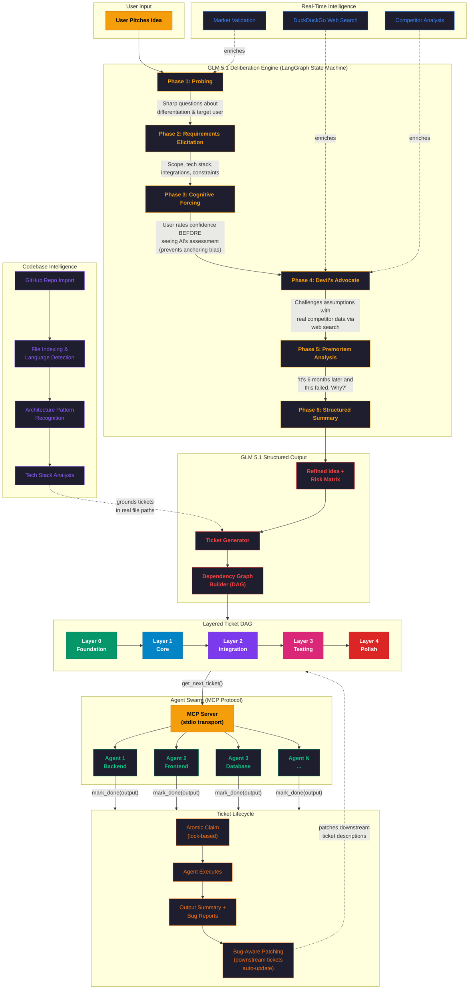
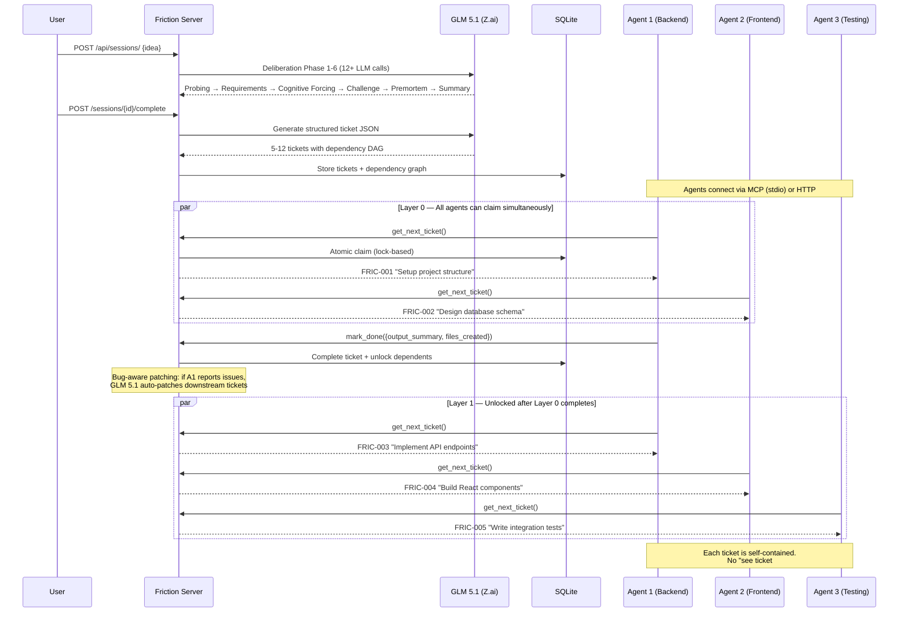

# Friction — The AI That Debates Your Idea Before Building the Plan

> "The AI that debates your idea, then builds the plan that survives the debate."

**Friction** is an AI deliberation engine powered by **GLM 5.1** that pressure-tests project ideas through structured multi-phase debate before generating implementation tickets. It replaces the "just start building" impulse with a rigorous thinking process — probing, challenging assumptions, running premortems — then produces a dependency-aware ticket DAG that coding agents can execute autonomously.

**Live Demo:** [https://zaihack.vercel.app](https://zaihack.vercel.app)

Built for the [Z.ai Builder Series](https://z.ai) hackathon (March 30 – April 6, 2026).

---

## The Problem: Task Delegation is Broken

Remember the Pied Piper problem from Silicon Valley? You have a brilliant idea, a team ready to build — but the moment you try to break it into tasks, everything falls apart. Tasks are vague, dependencies are missed, junior devs block senior devs, and half the team is building the wrong thing.

**This is the #1 failure mode in software.** Not bad code — bad planning.

Now multiply that by the age of AI agents. You can spin up 10 coding agents in parallel, but if you hand them vague tickets with tangled dependencies, you get 10 agents producing conflicting garbage. The bottleneck was never code generation — **it's task decomposition and delegation.**

Friction is the first system that **debates your idea before decomposing it**, then produces a dependency-aware DAG of self-contained tickets that agents (or humans) can execute in parallel without stepping on each other. Layer 0 tickets have zero dependencies. Layer 1 depends only on Layer 0. And so on. Every ticket is self-contained — no "see ticket #3" references, no implicit knowledge. An agent reading a single ticket knows exactly what to build, what files to touch, and what acceptance criteria to hit.

**This is the missing orchestration layer between "idea" and "agent swarm."**

---

## System Architecture



### How Agent Delegation Works



---

## What It Does & Who It's For

**For solo developers** who start building before thinking and end up rebuilding. **For teams running agent swarms** who need structured task delegation without conflicts. **For hackathon teams** who need to rapidly validate ideas and split work. **For engineering managers** who want structured ideation before sprint planning.

### The 6-Phase Deliberation

| Phase | What Happens | Why It Matters |
|-------|-------------|----------------|
| **Probing** | Sharp questions about differentiation, target user, scope | Kills vague ideas early |
| **Requirements** | Concrete scope, tech stack, integrations, constraints | Forces specificity |
| **Cognitive Forcing** | User rates confidence BEFORE seeing AI's scores | Prevents anchoring bias |
| **Devil's Advocate** | Challenges assumptions with real competitor data (web search) | Grounds ideas in reality |
| **Premortem** | "It's 6 months later and this failed. Why?" | Surfaces hidden risks |
| **Summary** | Structured JSON: refined idea, risks, scope, confidence delta | Machine-readable output |

---

## How GLM 5.1 Is Used (and Why)

Friction is a **long-horizon, multi-step reasoning system** — exactly the kind of workload GLM 5.1 excels at. It's not a single API call; every session makes **12+ sequential LLM calls** across 6 deliberation phases, each building on the full conversation context.

**Multi-phase deliberation**: Each session runs through probing → requirements → cognitive forcing → devil's advocate → premortem → summary. GLM 5.1's strong agentic reasoning handles the nuanced back-and-forth where the AI must remember context across phases, adjust its stance when the user makes strong arguments, and maintain coherent challenge throughout.

**Structured output generation**: After deliberation, GLM 5.1 generates complex JSON containing refined ideas, categorized risks with severity/mitigation, recommended scope, tech stack suggestions, and confidence deltas — then a second call generates 5-12 layered tickets with dependency graphs. The model's instruction-following ensures clean, parseable JSON output consistently.

**Tool use / Agent behavior via MCP**: The MCP server exposes Friction as a tool suite for coding agents. Agents call `get_next_ticket` → implement → `mark_done` in a fully agentic workflow. GLM 5.1's tool-use capabilities make it reliable for generating the structured ticket data that downstream agents consume.

**Bug-aware ticket patching**: When a completed ticket reports issues, GLM 5.1 analyzes upstream bug reports and patches downstream ticket descriptions with context-aware warnings — a multi-step reasoning task requiring understanding of dependency chains.

---

## Quick Start

### Prerequisites
- Python 3.12+
- Node.js 18+
- Z.ai API key ([get one here](https://z.ai))

### Backend
```bash
cd backend
cp .env.template .env
# Edit .env → add your ZAI_API_KEY
pip install -e ..    # installs from pyproject.toml
cd .. && python -m backend.run
# Server starts on http://localhost:8080
```

### Frontend
```bash
cd frontend
npm install
npm run dev
# Opens on http://localhost:5173
```

### MCP Server (for agent integration)
```bash
python -m backend.mcp_server
```

Add to your agent's MCP config:
```json
{
  "mcpServers": {
    "friction": {
      "command": "python",
      "args": ["-m", "backend.mcp_server"],
      "cwd": "/path/to/this/repo"
    }
  }
}
```

---

## Tech Stack

| Layer | Technology |
|-------|-----------|
| LLM | **GLM 5.1** via Z.ai OpenAI-compatible API |
| Backend | FastAPI, LangGraph, aiosqlite |
| Frontend | React 18, Vite, TypeScript, ReactFlow, Zustand, Tailwind CSS |
| Database | SQLite with JSON columns |
| Agent Protocol | MCP (Model Context Protocol) via stdio |
| Web Search | DuckDuckGo (grounding deliberation in real competitor data) |
| Deployment | Vercel (Fluid Compute for Python) |

---

## API Endpoints

| Method | Endpoint | Description |
|--------|----------|-------------|
| `POST` | `/api/sessions/` | Create session, start deliberation |
| `POST` | `/api/sessions/{id}/message` | Chat with Friction |
| `POST` | `/api/sessions/{id}/complete` | End deliberation, generate tickets |
| `POST` | `/api/sessions/{id}/tickets/next` | Atomic claim next ticket (lock-based) |
| `PATCH` | `/api/tickets/{id}` | Update ticket (complete/fail + output) |
| `GET` | `/api/sessions/{id}/workflow` | Dependency graph (DAG) |
| `WS` | `/ws` | Real-time events (ticket claims, completions) |

---

## Project Structure

```
backend/
  config.py              # Environment config (Z.ai API key, model)
  main.py                # FastAPI app with WebSocket + SPA serving
  services/
    llm.py               # GLM 5.1 client (OpenAI-compatible)
    db.py                # Async SQLite operations
    web_search.py        # Web search for grounding deliberation
  deliberation/
    engine.py            # Session orchestrator
    graph.py             # LangGraph state machine (6-phase flow)
    nodes.py             # Phase node functions (probe, challenge, etc.)
    prompts.py           # System prompts for each deliberation phase
    state.py             # Deliberation state schema
  tickets/
    generator.py         # LLM-powered ticket generation (layered DAG)
    manager.py           # Ticket lifecycle + bug-aware patching
    dependency_graph.py  # DAG builder + topological ordering
  codebase/
    importer.py          # Git clone + directory walker
    analyzer.py          # LLM-powered codebase analysis
    indexer.py           # File indexing + language detection
    github_issues.py     # GitHub issue fetcher
    issue_ticket_generator.py  # Convert issues → tickets
  mcp_server/
    server.py            # MCP stdio server for agent integration
  routers/               # FastAPI route handlers
  models/                # Pydantic models
frontend/
  src/
    components/          # React components (chat, ticket board, DAG viz)
    store/               # Zustand state management
    lib/                 # API client, utilities
```

---

## Why This Matters

Every AI coding tool today focuses on **generating code faster**. None of them ask: *should this code exist?*

Friction is the layer that sits between your idea and your agent swarm. It's the architect that refuses to let you build on a shaky foundation. It's the senior engineer who asks "have you considered..." before you've written a single line.

The result: when your agents start building, they're building the **right thing**, in the **right order**, with **zero coordination overhead**.

---

## License

MIT

---

Built with GLM 5.1 by [Kevin](https://github.com/Kvndoshi) for the Z.ai Builder Series hackathon.

#buildwithglm
